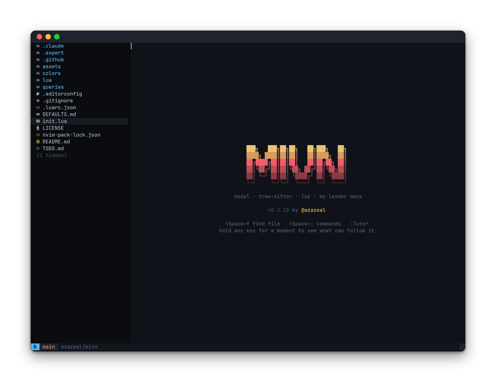

# mivn

<!--toc:start-->
- [mivn](#mivn)
  - [What I want from it](#what-i-want-from-it)
  - [Installing](#installing)
  - [Fonts](#fonts)
  - [A remote window](#a-remote-window)
  - [Local overrides](#local-overrides)
  - [Layout](#layout)
  - [The additions](#the-additions)
<!--toc:end-->

My Neovim configuration, written from scratch on Neovim 0.12, for Neovide on
the desktop and the terminal everywhere else.



## What I want from it

- **Defaults first.** Vim's grammar as it ships is the product. The custom
  surface is a handful of leader keys and a few bridges, and it is meant to
  stay that small: anything rare goes through the command palette instead of
  earning a key.
- **My hands keep working.** I come from CUA editors (VS Code, Zed). Shift and
  an arrow selects, typing replaces the selection, the clipboard is the
  system one, PageUp/PageDown always go somewhere. All of it rides options
  Vim ships for exactly that purpose, so the grammar underneath stays intact
  while I learn it.
- **Looks matter.** The basalt theme, shared with my other tools; one
  status line, a tab bar of buffers, git in the gutter and in the tree.
- **A tool, not a project.** Few plugins, all pinned. New friction becomes a
  line in TODO.md and gets fixed in batches, not the same day.

## Installing

What has to be on the system:

- **Neovim's latest stable release** (0.12 or newer). The config leans on
  0.12 features: `vim.pack` for plugins, `'autocomplete'` for completion.
- **git**, which `vim.pack` uses to fetch the pinned plugins on first start.
- **A C compiler** (`cc`, `gcc`, or `clang` on `PATH`), which
  `:MivnInstallGrammars` needs: tree-sitter grammars compile from source.
  Without one, and until that command runs, the grammars Neovim ships with
  still highlight and everything else falls back to classic syntax
  highlighting; nothing breaks.
- **A Nerd Font**, for the icons in the tree, the tab bar, and the pickers.
  See [Fonts](#fonts) for where the font is actually chosen.
- **ripgrep** (or **fd**), optionally: `<Space>f` and `<Space>/` use whichever
  is installed, and fall back to slower built-ins otherwise.

Most language servers are managed: opening a covered file offers to install
the server, pinned and checksum-verified, into Neovim's data directory
(`lua/mivn/store.lua` is the manifest), and no language runtime needs to
exist on the machine. That covers Python (`ty`, `ruff`), TypeScript and
JavaScript (`tsgo`, the TypeScript 7 compiler with the LSP inside), Rust,
Lua, Elixir, Markdown, TOML, HTML, Terraform, Protocol Buffers, templ, and
the Docker files. The few still expected on `PATH` until their runtime
passes land: `gopls` and `golangci-lint-langserver` (Go), `ruby-lsp`, and
`deno` for Deno workspaces. `:MivnLsp` lists both kinds and what was found.
The external formatters (`stylua`, `shfmt`, `jq`, `taplo`, `xmllint`) and
`gci` for Go imports are `PATH` tools still.

This is a plain Neovim configuration: clone it where Neovim looks and run
`nvim`.

```
git clone https://github.com/azazeal/mivn.git ~/.config/nvim
```

The first start clones the plugins at their pinned revisions, which takes a
few seconds; then run `:MivnInstallGrammars` once for the grammars. Personal
settings, if any, go into `lua/mivn/local.lua` (see
[Local overrides](#local-overrides)).

To try it without touching an existing configuration, clone it anywhere and
run it isolated under a different name:

```
git clone https://github.com/azazeal/mivn.git ~/.config/mivn
NVIM_APPNAME=mivn nvim
```

## Fonts

Nothing here sets a font, on purpose. In the terminal the font is the
terminal's. In Neovide it comes from Neovide's own
`~/.config/neovide/config.toml`. A font and its size are a per-machine,
per-screen choice, and an editor config has no way to make that choice well;
Neovim cannot even ask the compositor for the monitor's physical size.

## A remote window

Neovim can run on one machine with its window on another: Neovide attaching
over ssh, with `--neovim-bin` pointing at a wrapper that runs the editor on
the far host. One command must not work there. `:restart` starts the new
editor on the machine the old one ran on and hands the window an address on
that machine's filesystem, so the window dies trying to connect and a
headless editor is left running behind it; Neovim's own docs call out the
same-system limit. mivn refuses `:restart` and `ZR` in that setup and says
why.

Export `MIVN_REMOTE_UI=1` in whatever launches the remote session to declare
it. Without the variable, a remote Neovide is still recognized by the
clipboard bridge it registers, but the variable is the supported switch: it
survives Neovide configuration changes and covers UIs this config has never
heard of.

## Local overrides

`lua/mivn/local.lua` is optional, gitignored, and returns a table of personal
settings the config reads when the file exists;
`lua/mivn/local.example.lua` is the committed template to copy from, and it
documents every key. Two kinds today: `lsp`, per-server tuning (turn one
off, point one at an executable of your own, add settings, set a health
probe, and for gopls the import prefixes that count as yours), and
`treesitter_grammars`, additions and drops to the grammar list. Any key can
be scoped to a directory through `projects`, so
different clients can carry different values. Without the file, everything
runs on the defaults the repo ships.

## Layout

| Path          | What it holds                                             |
|---------------|-----------------------------------------------------------|
| `init.lua`    | Options and the command-line setup                        |
| `lua/mivn/`   | One module per concern; trade-offs live in each header    |
| `colors/`     | The basalt theme                                          |
| `queries/`    | Tree-sitter extras: SQL in Go strings, gotmpl files       |
| `DEFAULTS.md` | The tour of stock Vim, and what mivn changes, marked so   |
| `TODO.md`     | State and queue; friction lands here first                |

## The additions

The whole custom key list: `<Space>f` find file, `<Space>/` search the
project, `<Space>b` buffers, `<Space>:` command palette, `<Space>h` help,
`<Space>d` diagnostics, `<Space>t` show or hide the file tree, `` <Space>` ``
show or hide the terminal, `<Space>w` wrap long lines in this window,
`gd` go to definition, `Ctrl+Del` delete the word
ahead, and `Ctrl+Tab` / `Ctrl+Shift+Tab` along the tab bar. `Esc` in Normal
mode also clears leftover search highlighting. Everything else is stock Vim, or a stock
option doing its documented job. [DEFAULTS.md](DEFAULTS.md) is the full
account, including what each bridge costs.
